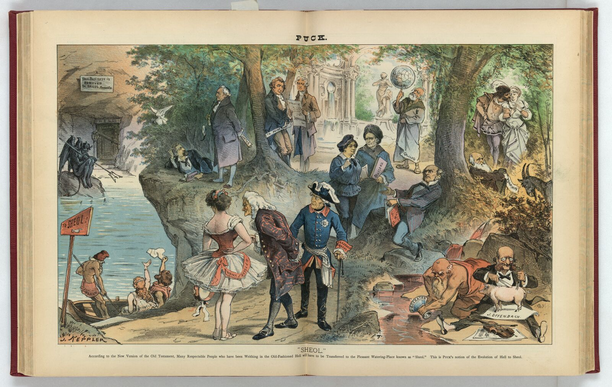
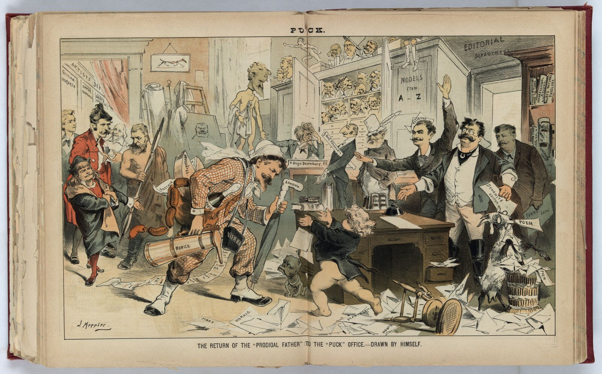
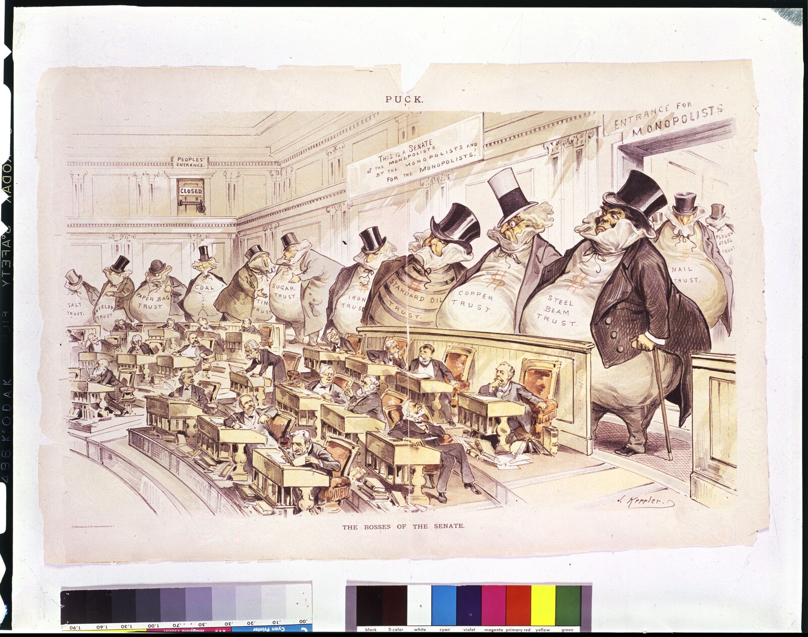

# The Keppler Rooms

A private, guided audio tour of four chromolithographs by **Joseph Keppler** (1838–1894),
from the covers and centerfolds of *Puck* — built as a self-contained static site.

A synthesized guide (warm neural voice) walks the visitor through four rooms,
choreographs their gaze across the picture, asks Socratic questions
(*What do you see? What do you think? What do you feel?*), and never rushes:
every question opens a private journal, and every answer stays on the visitor's device.

<p align="center">
  
  
  
  
</p>

> **Status: MVP.** The tour is complete and shippable — 4 rooms, 35 narration beats,
> ~25 minutes, zero dependencies and zero third-party calls at runtime.

---

## The four rooms

| Room | Work | Date |
|------|------|------|
| One | *Sheol* — the Revised Version Bible joke, with Darwin & Voltaire on Charon's ferry | May 27, 1885 |
| Two | *The Return of the "Prodigal Father"* — Keppler's self-caricature homecoming | Oct 10, 1883 |
| Three | *The Bosses of the Senate* — the money-bag trusts | Jan 23, 1889 |
| Four | *Puck's Own Yorktown Celebration* — the whole cast of Puck on parade | Oct 19, 1881 |

All source imagery: Library of Congress, no known restrictions.

---

## What it teaches

The tour is a lesson in **looking before being told**. The method is borrowed from
Visual Thinking Strategies: the guide narrates what is documented, then stops talking
and asks what the visitor actually sees — with the answers treated as material, not
as a test. There are no wrong answers, and nothing is scored or stored anywhere but
the visitor's own browser.

**1. It starts by teaching you how to watch.**

> "A word about how this works. In each room I'll show you a picture, and mostly I will
> stay quiet while you look. Then I'll ask what you saw — and I mean it: there are no
> wrong answers here. Not out of politeness, but because what you notice is the only
> thing this tour is actually about."

**2. It gives you the documented context, then asks.** For example, in *The Bosses of
the Senate*:

> "Washington. The Senate chamber — and something is wrong with the seating. Look at the
> back rows. Those are not senators. Those are money bags. Great bloated sacks, in top
> hats, with human faces — and name tags. The copper trust. The sugar trust. Iron. Steel
> beam. Tin. Coal. Paper bag. And largest of all, on the left: Standard Oil. […]"

**3. It asks questions that can't be answered with a lookup.** Every room has a first
look and a closing reflection; each opens a private journal. The hints are the best
part — they're provocations, not solutions:

| Room | The question | The hint, if you want one |
|------|--------------|---------------------------|
| One · *Sheol* | What did you see? What is going on in this picture? | "If you'd like a thought: try naming the first three things your eye found, in order. That order is a map of you as much as of the picture." |
| Two · *Prodigal Father* | What does making yourself the joke buy you? | "An old rule of satire: the jester who can laugh at himself earns the right to laugh at kings. The armor is thin on purpose, so you can see the person inside. It buys trust — or sets a trap. You decide." |
| Three · *Bosses* | Where did your eye land — the giants, or the senators? | "Scale is the argument. In this room, size is not a property of bodies; it is a property of power. Your eye obeyed the picture's physics before your mind could vote." |
| Four · *Yorktown* | Who gets a place in this parade? Who would you add from now? | "This is Keppler's self-portrait as a body of work: his fame is a parade of the people he caught. When you imagine your own life's work passing in review — what is marching? And what would you rather not be seen in the column?" |
| Three · close | Where is the bolted door now? What is this picture asking of you? | *(no hint — you're on your own)* |

**4. It shows its sources rather than asserting.** Each room carries curator notes in
the in-app *Notes & sources* drawer (`N`), and the narration itself is grounded in the
Library of Congress catalog records. The *Sheol* note, for example:

> **The premise, exactly** — The English Revised Version of the Bible — the only ever
> authorized revision of the King James — appeared in installments: New Testament
> May 17, 1881; Old Testament May 17–19, 1885. The Hebrew word Sheol occurs about 64
> times in the Old Testament; the King James Version renders it “hell” some 31 times,
> “grave” some 31 times, “pit” 3 times.
>
> — Revised Version Preface (1885), primary text via bible-researcher.com; LOC record 2011661750

**5. It moves the camera for you, then hands it back.** Every narration beat can carry a
focus point (`x, y, scale`); the viewer eases to it over ~3s. Grabbing the image at any
time interrupts the glide — the visitor's gaze always wins.

**6. Nothing leaves the device.** Journal entries, progress, and settings live in
`localStorage` only. The journal exports as Markdown from the finale. The page makes
zero external requests — no fonts, no analytics, no CDN.

Full narration is readable in [`data/tour.json`](data/tour.json); every factual claim is
mapped to its source in [`research/FACT-LEDGER.md`](research/FACT-LEDGER.md).

---

## Run it locally

```bash
cd art_experience
python3 -m http.server 8123
# open http://127.0.0.1:8123
```

(Any static server works. Serving over `file://` also works, but a local server is nicer
for audio preloading.)

## Checks

Stdlib-only smoke test — catches a stale `tour-data.js`, a missing asset, a beat with no
audio, or a stray heavyweight file swept into the payload. Run it before and after
uploading:

```bash
python3 tests/smoke_test.py                     # check the working tree
python3 tests/smoke_test.py --url https://your-host/keppler-rooms/   # check a live deploy
```

Exit code 0 means all green.

## Deploy to a website

The runtime needs exactly four things:

```
index.html  css/  js/  assets/
```

Ship those and nothing else. Everything under `originals/`, `work/`, and
`master-*.tif` is heavy source material (~700 MB) and must not be uploaded;
`build/`, `data/`, `research/`, and `context/` are the tour's source and are safe
to publish but are not needed to serve it.

```bash
# rsync the ship set only
rsync -av --delete index.html css js assets user@host:/var/www/keppler-rooms/

# verify before and after
python3 tests/smoke_test.py
python3 tests/smoke_test.py --url https://your-host/keppler-rooms/
```

Total payload: ~18 MB images + ~6 MB audio. No build step, no dependencies,
no external requests — fonts are the system serif stack, so the page makes zero
third-party calls.

## Editing the tour

Everything the guide says lives in **`data/tour.json`** — narration text,
Socratic questions, curator hints, **per-room scholar notes** (shown in the in-app
"Notes & sources" drawer, key `N`), camera focus points (normalized `x, y, scale`
per beat), and dwell times for silent-looking beats.

After editing the script, regenerate audio (only changed beats re-synthesize).
One-time setup first — `work/` is gitignored scratch, so a fresh clone has no
virtualenv yet:

```bash
python3 -m venv work/venv
work/venv/bin/pip install -r requirements.txt   # edge-tts only

work/venv/bin/python build/generate_audio.py
```

Also needs `ffmpeg`/`ffprobe` on `PATH` (durations and non-MP3 conversion).
Synthesis needs internet at generation time only.

The script uses [edge-tts](https://github.com/rany2/edge-tts) (Microsoft neural voices).
Voice/rate are set in `tour.json` → `meta.voice` / `meta.rate`. Generated MP3s land in
`assets/audio/`, and the baked data file `js/tour-data.js` is rewritten with durations.

If a narration MP3 is missing or fails, the app automatically falls back to the
browser's built-in speech synthesis — **for that one beat only**; the next beat
resumes the recorded voice.

## Using your own voices (Colab TTS, voice cloning, etc.)

The narration is recorded audio, so any TTS that produces MP3s drops straight in:

```bash
# 1. export the script (id + text for all 35 spoken beats)
work/venv/bin/python build/export_beats.py            # → work/tts_export/beats.{json,txt}

# 2. synthesize on Colab however you like (XTTS, Bark, F5-TTS, Google TTS, a
#    cloned narrator voice…) — one file per beat, named  <beat_id>.mp3
#    (wav/m4a also accepted; converted automatically)

# 3. install the results
work/venv/bin/python build/adopt_external_audio.py --src path/to/your/output
```

The adopt script validates every file (playable, >2 KB, real duration), converts
non-MP3s, installs into `assets/audio/`, and re-bakes `js/tour-data.js` with the
new durations and cache-busting hashes. External audio is keyed to the current
narration text: if you later reword a beat in `tour.json`, only that beat reverts
to the edge-tts voice on the next build — re-synthesize it (or the whole set) and
re-adopt to keep one consistent voice.

## The scholarship layer

The narration is grounded in primary records (Library of Congress captions and
catalog descriptions, the 1885 Revised Version preface) and the scholarly
literature — West's *Satire on Stone* (the standard monograph), Kahn & West's
*What Fools These Mortals Be*, Hess & Kaplan's *The Ungentlemanly Art*, Marzio's
*The Democratic Art*, Fischer's *Them Damned Pictures*, Brown's *Beyond the Lines*,
and peer-reviewed work such as Richard R. John's "Robber Barons Redux"
(*Enterprise & Society*, 2012). Three files carry this layer:

- **`research/DOSSIER.md`** — the full curated context per room: records, iconography,
  reception, method, and a tiered bibliography ([PRIM]/[PEER]/[SCH]/[MUS]/[REF])
  with a standing list of widely-retold-but-unverified claims that must never be
  stated as fact.
- **`research/FACT-LEDGER.md`** — every factual claim spoken in the narration mapped
  to its source and confidence status. (Writing it already caught one arithmetic
  error: "twenty-three years after Gettysburg" → twenty-five.)
- **`context/AGENT-BRIEF.md`** — the prepped system context for a future interactive
  Socratic guide agent: role and voice, the VTS questioning protocol, per-work
  context cards with camera focus maps, a question bank, cross-links, guardrails,
  and a citation pocket. Load it plus the dossier as system context if you ever
  wire a live LLM guide; the site works fully without one.

## Pipeline provenance

- `originals/*.tif` — LOC master scans (58–148 MB each), kept out of git.
  - `sheol.tif` — LC-DIG-ppmsca-28201 (item [2011661750](https://www.loc.gov/item/2011661750/))
  - `prodigal_father.tif` — LC-DIG-ppmsca-28432 (item [92520934](https://www.loc.gov/item/92520934/))
  - `yorktown.tif` — LC-DIG-ppmsca-28522 (item [2012647294](https://www.loc.gov/item/2012647294/))
  - `bosses_senate.tif` — LC-USZC4-494 (item [2002718861](https://www.loc.gov/item/2002718861/))
- `assets/img/` — web derivatives: 4200px JPEG + WebP (full), 1600px JPEG (mid),
  320px thumb, 24px LQIP (inlined in `js/lqip.js`).
- To re-derive images from the TIFFs: `convert originals/<name>.tif -colorspace sRGB -resize 4200x4200> -strip -quality 84 assets/img/<name>_full.jpg` (etc.)

## Design notes

- **Camera = the guide's gaze.** Each narration beat can define a `focus`; the viewer
  eases there over ~3s (respecting `prefers-reduced-motion`). The visitor can grab the
  image at any time — drag to pan, wheel/pinch to zoom, double-click to zoom.
- **Two resolution tiers.** The 1600px layer paints instantly; the 4200px WebP fades in
  when zoomed past ~1.04×.
- **Privacy.** Journal, progress, and settings live in `localStorage` only. The journal
  is exportable as Markdown from the finale.
- **Accessibility.** Full transcript panel (T), keyboard controls (space, ←/→, C, T),
  reduced-motion support, `[hidden]`-safe styling.

## Keyboard

`space` play/pause · `←`/`→` previous/next beat · `T` transcript · `C` contents · `N` notes & sources · `Esc` close panels
